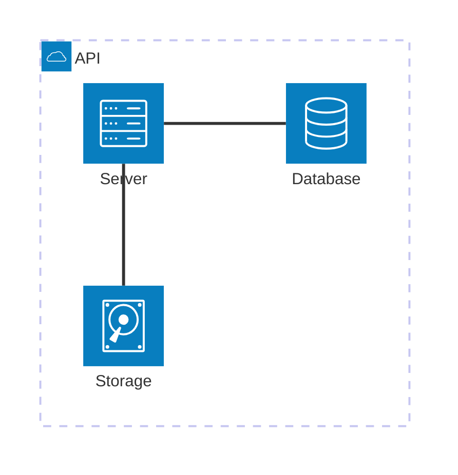

# Architecture Diagram Syntax

## Syntax

## Elements
- `group id(icon)[Label]`
- `service id(icon)[Label]`
- `in groupId`: Nesting
- `junction id`

## Icons
- `cloud`, `database`, `disk`, `internet`, `server`
- Extensible via icon packs

## Edges
- `id:Side -- Side:id` (Side: L, R, T, B)
- Arrows: `<` and `>` (e.g., `id:R --> L:id`)
