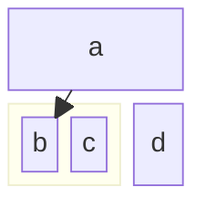

# Block Diagram Syntax

## Syntax

## Features
- `columns <N>`: Set number of columns (default 1)
- `block:id` ... `end`: Group blocks
- `id:width`: Set block width (spanning columns)
- `space`: Skip a cell
- `space:width`: Skip multiple cells
- Arrows: `-->`, `-- text -->`
