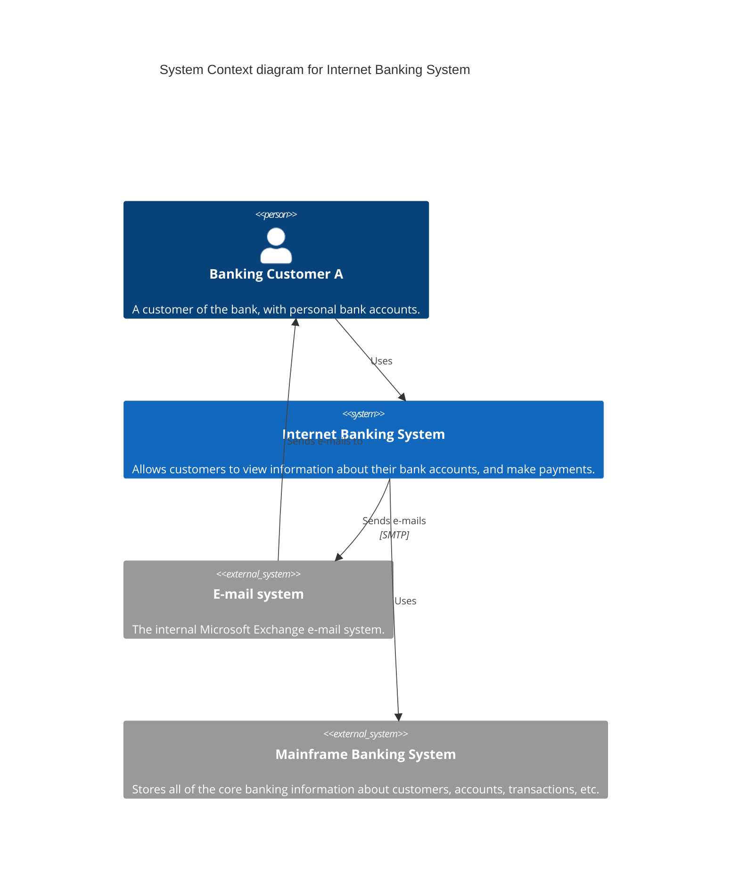

# C4 Diagram Syntax

## Context

## Types
- `Person(alias, label, desc)`
- `System(alias, label, desc)`
- `System_Ext(alias, label, desc)`
- `Container(alias, label, technology, desc)`
- `Component(alias, label, technology, desc)`
- `Rel(from, to, label, technology)`
