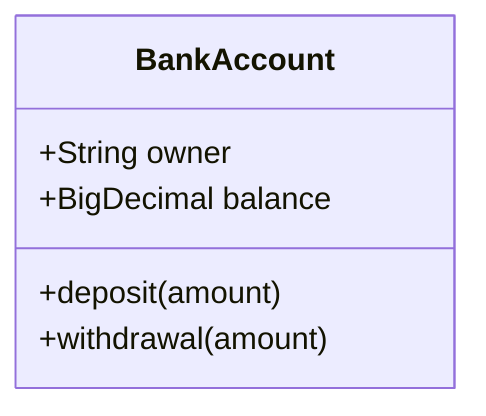

# Class Diagram Syntax

## Class Definition

## Relationships
- `<|--`: Inheritance
- `*--`: Composition
- `o--`: Aggregation
- `-->`: Association
- `--`: Link (Solid)
- `..>`: Dependency
- `..|>`: Realization
- `..`: Link (Dashed)

## Visibility
- `+`: Public
- `-`: Private
- `#`: Protected
- `~`: Package/Internal

## Multiplicity
`Customer "1" --> "*" Ticket`

## Generic Types
`class List~T~`
