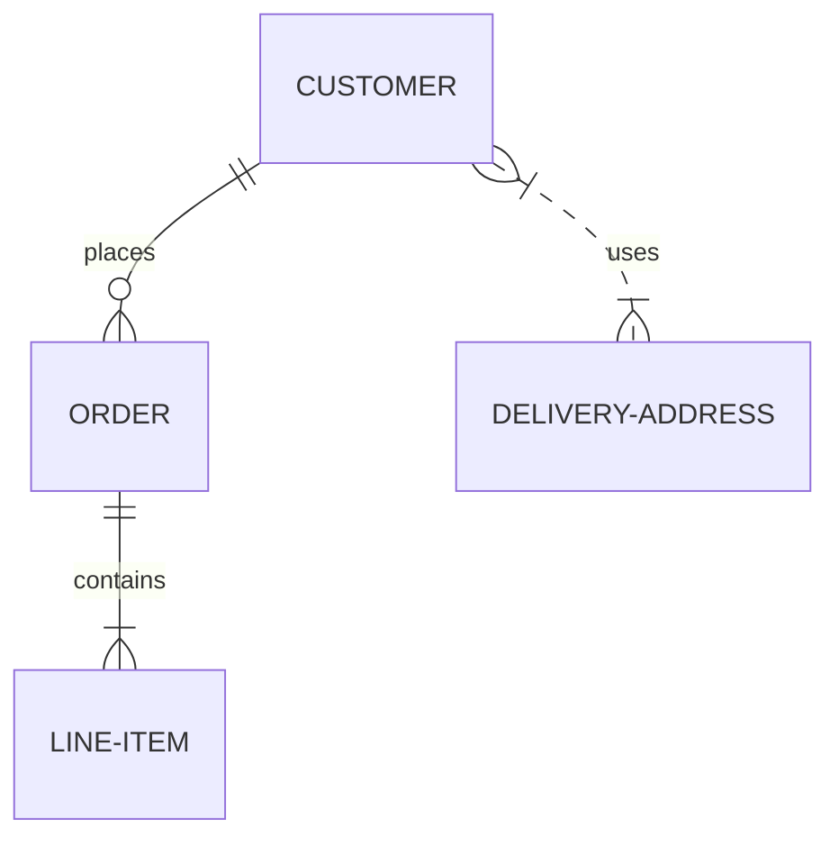
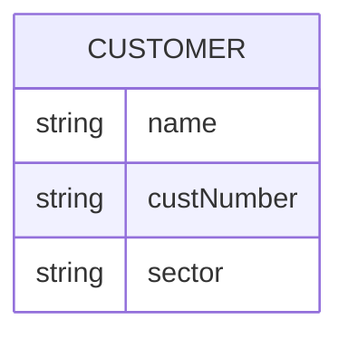

# Entity Relationship Diagram Syntax

## Syntax
`FirstEntity [Relationship] SecondEntity : Label`

## Cardinality
- `|o` : Zero or one
- `||` : Exactly one
- `}o` : Zero or more
- `}|` : One or more

## Relationships
- `..` : Dashed
- `--` : Solid

## Example

## Attributes

