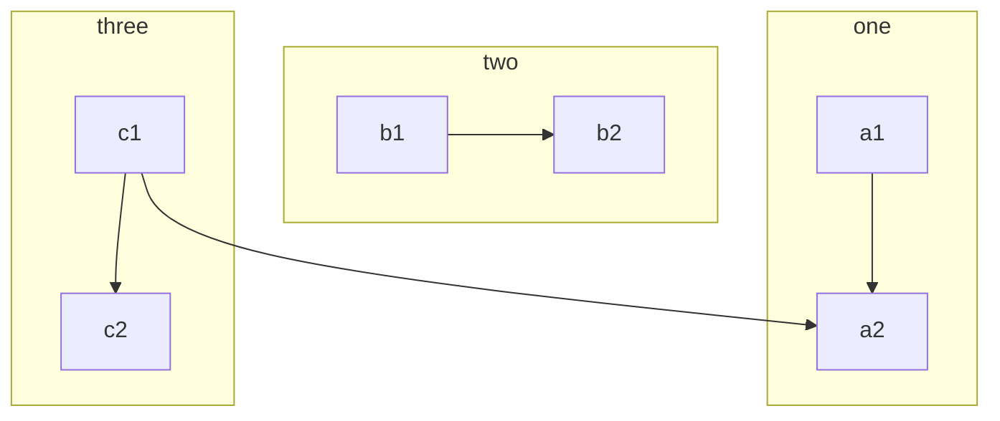
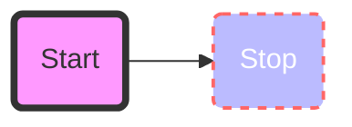

# Flowchart Syntax

## Nodes
- **Default**: `id`
- **Text**: `id[Text]`
- **Round**: `id(Text)`
- **Circle**: `id((Text))`
- **Stadium**: `id([Text])`
- **Subroutine**: `id[[Text]]`
- **Cylindrical**: `id[(Text)]`
- **Asymmetric**: `id>Text]`
- **Rhombus**: `id{Text}`
- **Hexagon**: `id{{Text}}`

## Links
- **Arrow**: `A --> B`
- **Open**: `A --- B`
- **Text**: `A -- Text --> B` or `A -->|Text| B`
- **Dotted**: `A -.-> B`
- **Thick**: `A ==> B`

## Direction
- `TD` or `TB`: Top-Down
- `LR`: Left-Right

## Subgraphs

## Styling

