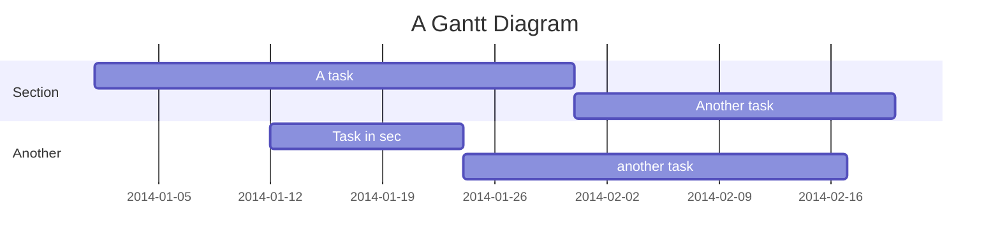

# Gantt Chart Syntax

## Basic Structure

## Configuration
- `dateFormat`: e.g., `YYYY-MM-DD`
- `axisFormat`: e.g., `%m/%d`
- `excludes`: `weekends`, `sunday`

## Task States
- `done`: Completed task
- `active`: Currently active
- `crit`: Critical path
- `milestone`: Milestone (diamond shape)

## Dependencies
- `after id`: Starts after task `id`
- `until id`: Runs until task `id` starts
