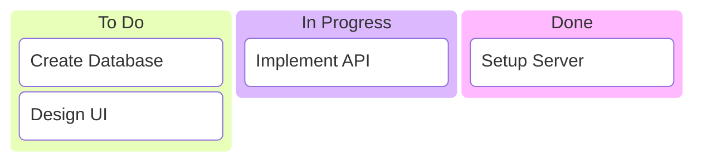

# Kanban Diagram Syntax

## Syntax

## Metadata
- `task@{ ticket: "PROJ-123", priority: "High", assigned: "Alice" }`
- Global config: `ticketBaseUrl`

## Structure
- `columnId[Title]`
  - Indented `taskId[Description]`
