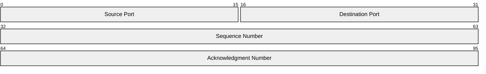

# Packet Diagram Syntax

## Syntax

```mermaid
packet-beta
  0-15: "Source Port"
  16-31: "Destination Port"
  32-63: "Sequence Number"
  64-95: "Acknowledgment Number"
```

## Features
- Range: `start-end`
- Relative: `+<bits>` (e.g., `+1: "Flag"`)
- Label: `"Description"`
