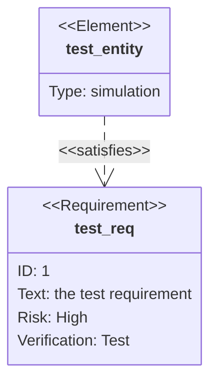

# Requirement Diagram Syntax

## Syntax

## Elements
- `requirement`: id, text, risk, verifymethod
- `element`: type, docref

## Relationships
- `contains`
- `copies`
- `derives`
- `satisfies`
- `verifies`
- `refines`
- `traces`
