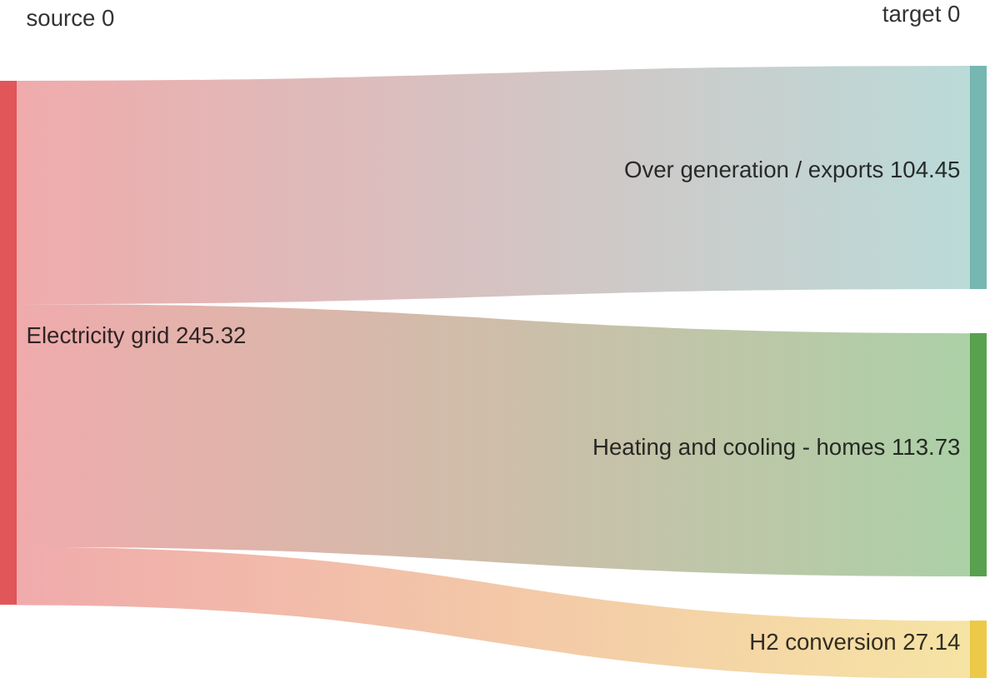

# Sankey Diagram Syntax

## Syntax

```mermaid
sankey-beta
    source,target,value
    Electricity grid,Over generation / exports,104.453
    Electricity grid,Heating and cooling - homes,113.726
    Electricity grid,H2 conversion,27.14
```

## Rules
- CSV format: `source,target,value`
- Commas in strings must be quoted: `"Node, with comma"`
- Double quotes must be escaped: `"Node with \"quote\""`
