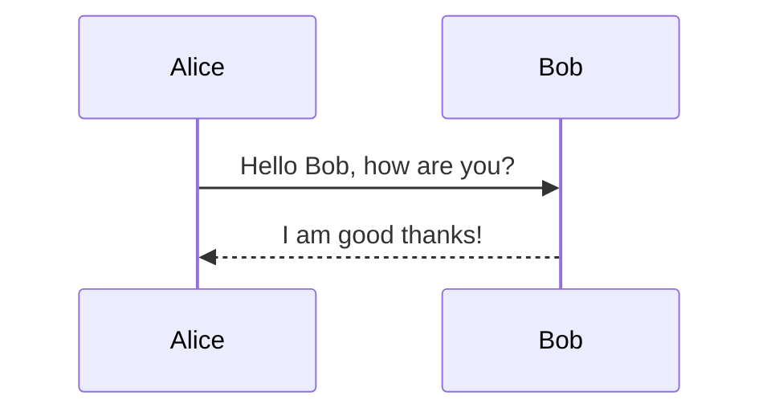
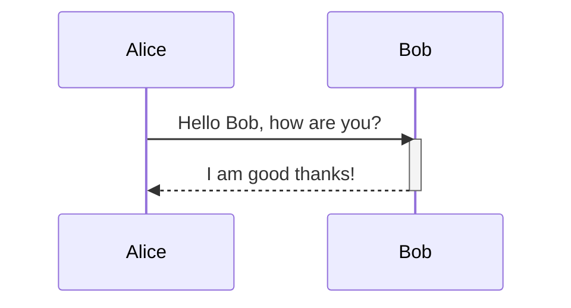
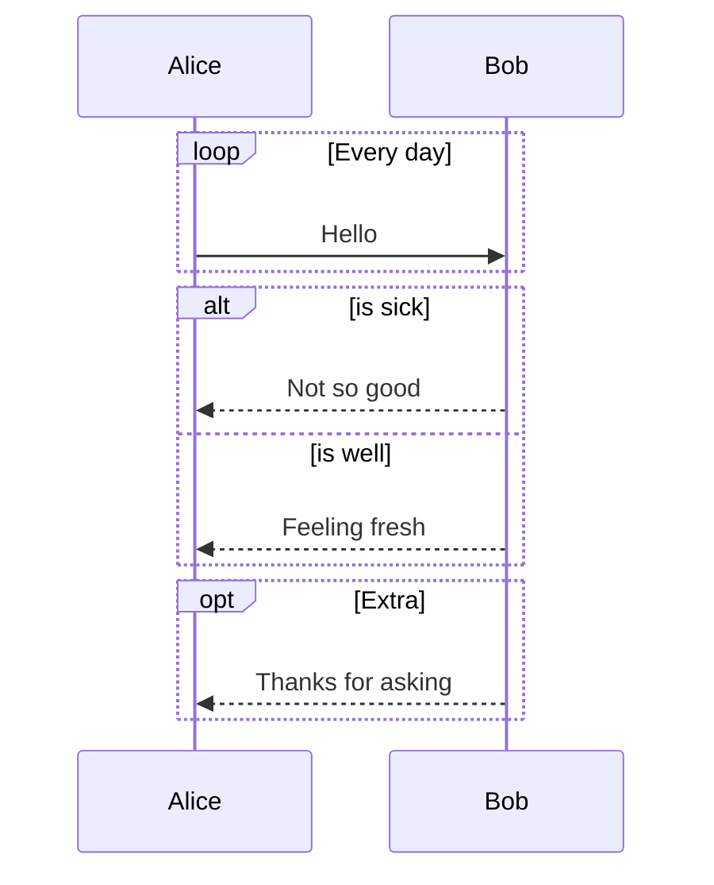

# Sequence Diagram Syntax

## Participants

## Messages
- `-> `: Solid line without arrow
- `-->`: Dotted line without arrow
- `->>`: Solid line with arrowhead
- `-->>`: Dotted line with arrowhead
- `-x`: Solid line with cross at end
- `--x`: Dotted line with cross at end

## Activations

Shortcut: `Alice->>+Bob: Hello` and `Bob-->>-Alice: Hi`

## Loops, Alt, Opt

## Notes
`Note right of Bob: Bob thinks`
`Note over Alice,Bob: A typical interaction`
