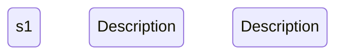
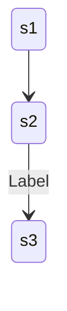
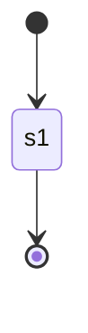
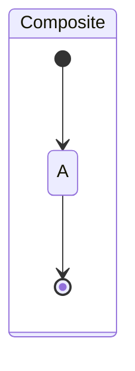
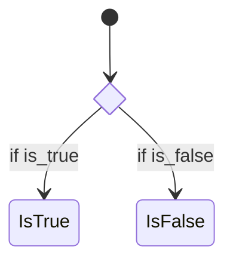
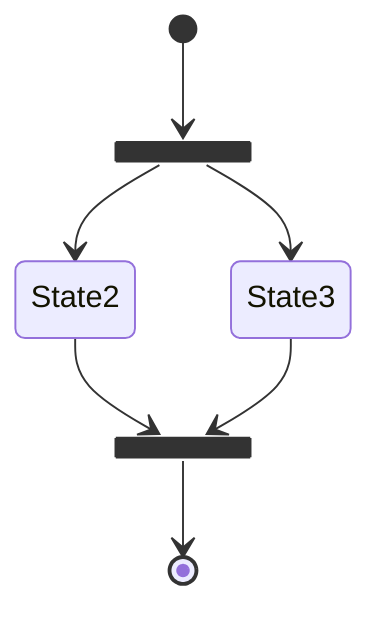

# State Diagram Syntax

## States

```mermaid
stateDiagram-v2
    s1
    state "Description" as s2
    s3 : Description
```

## Transitions

```mermaid
stateDiagram-v2
    s1 --> s2
    s2 --> s3 : Label
```

## Start/End

```mermaid
stateDiagram-v2
    [*] --> s1
    s1 --> [*]
```

## Composite States

```mermaid
stateDiagram-v2
    state Composite {
        [*] --> A
        A --> [*]
    }
```

## Choice

```mermaid
stateDiagram-v2
    state if_state <<choice>>
    [*] --> if_state
    if_state --> IsTrue : if is_true
    if_state --> IsFalse : if is_false
```

## Forks/Joins

```mermaid
stateDiagram-v2
    state fork_state <<fork>>
    [*] --> fork_state
    fork_state --> State2
    fork_state --> State3

    state join_state <<join>>
    State2 --> join_state
    State3 --> join_state
    join_state --> [*]
```

## Config
```mermaid
stateDiagram-v2
    direction LR
```
