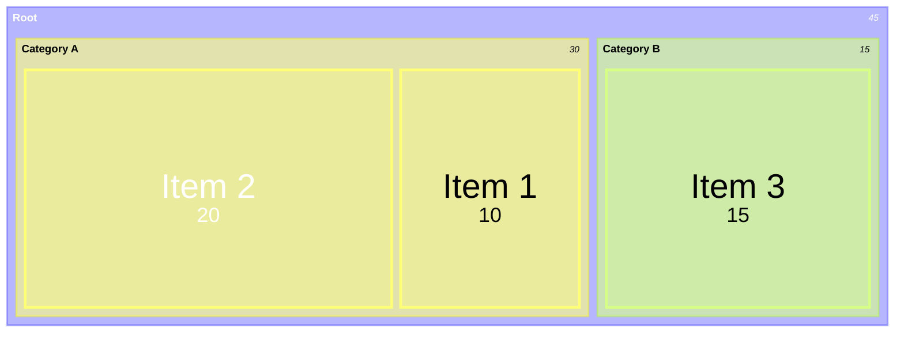

# Treemap Diagram Syntax

## Syntax

## Structure
- Hierarchy defined by indentation
- Leaf nodes have values: `"Name": value`
- Parent nodes just have names: `"Name"`
- CSS classes with `:::className`
