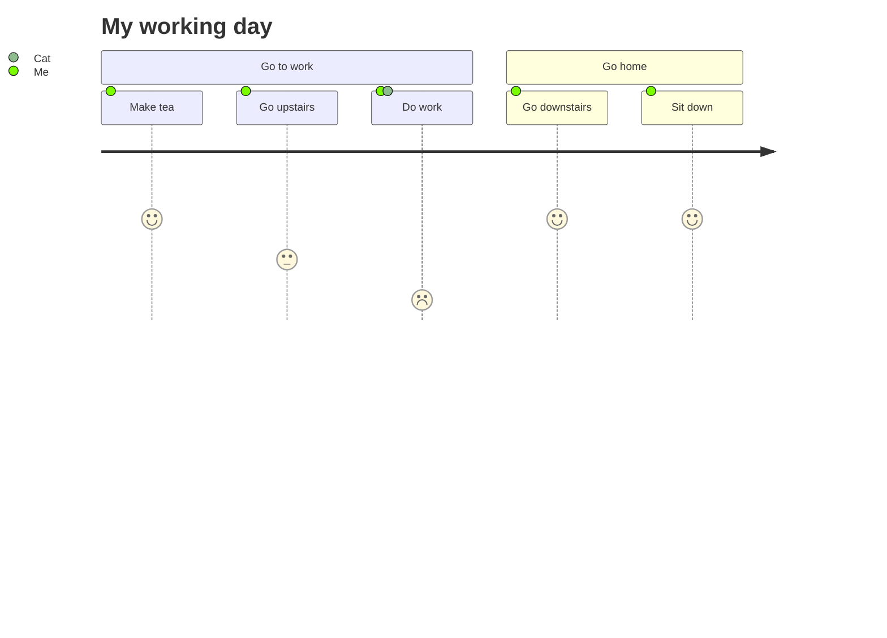

# User Journey Diagram Syntax

## Syntax

```mermaid
journey
    title My working day
    section Go to work
      Make tea: 5: Me
      Go upstairs: 3: Me
      Do work: 1: Me, Cat
    section Go home
      Go downstairs: 5: Me
      Sit down: 5: Me
```

## Components
- `title`: Diagram title
- `section`: Groups steps
- Task Format: `Task name: Score: Actors`
- Score: 1-5
