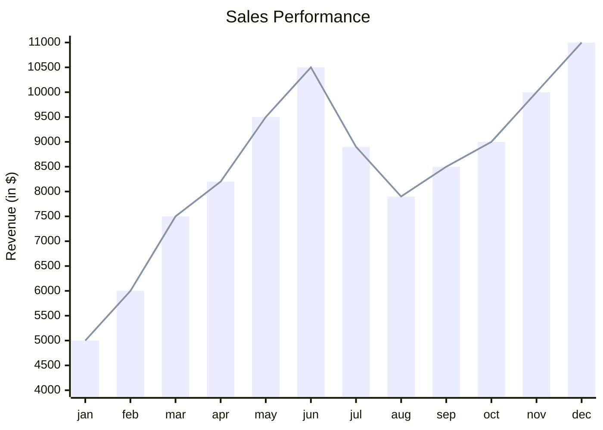

# XY Chart Syntax

## Syntax

```mermaid
xychart-beta
    title "Sales Performance"
    x-axis [jan, feb, mar, apr, may, jun, jul, aug, sep, oct, nov, dec]
    y-axis "Revenue (in $)" 4000 --> 11000
    bar [5000, 6000, 7500, 8200, 9500, 10500, 8900, 7900, 8500, 9000, 10000, 11000]
    line [5000, 6000, 7500, 8200, 9500, 10500, 8900, 7900, 8500, 9000, 10000, 11000]
```

## Configuration
- `xychart-beta horizontal`
- `x-axis [categories]` or `x-axis min --> max`
- `y-axis min --> max`
- `bar [values]`
- `line [values]`
