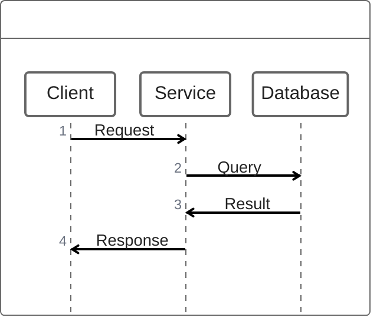

# ZenUML Syntax

## Syntax

## Features
- `Participant: message`
- `A -> B: Sync message`
- `A ->> B: Async message`
- `new A`: Creation
- `// comment`
- `opt`, `loop`, `alt`, `try`, `catch`, `finally` block structures
- `group`
